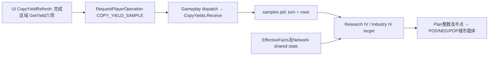
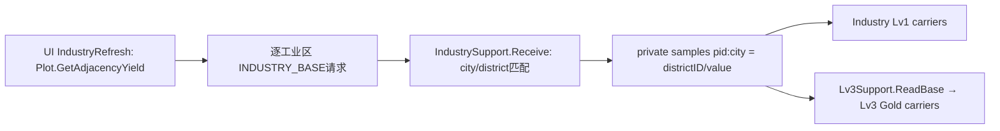

# Architecture v2 C2 — Copy Yield + Industry sampling lifecycle

Document Owner: Codex
Build: develop B075.102 / modinfo102
Parent: e1549aa / B074.101 (D1 accepted)
State: LOCAL_SIMULATION_PASS / awaiting review / NOT DEPLOYED
Design: D0025 unchanged
Mainline: A → B → C1 → D1 → C2 → D2 → E

## 用户摘要

Copy与Industry改为带回执、版本和对象身份校验的后台采样。待回应时不重复发送；暂时读取不到不再作为零收益；完整验证后替换；真正删除/失去资格才撤销。同一逻辑样本最多发送3次。本地63组正常载体结果与B074一致，D1等回归通过。当前不部署、不要求用户切换测试；本地通过不等于游戏通过，更不等于55GB内存问题解决。建议审阅后进入D2。

## 原Copy链 / STATIC_CONFIRMED

STATIC_CONFIRMED为代码证据，不代表已在游戏复现全部时序。

- Copy sample是全玩家完成区域的cityID/districtID/六项yield总和/production；UI读实际区域GetYield，不是城市总yield，也不是只读adjacency。
- 旧key=generation/turn/valid/payload；UI另比较接收端seq。尚未收到回复时seq不一致，每次pulse都可再发送。真实旧Lua模拟延迟transport：初次+10,000通知=10,001次actual send。
- 旧Receive先推进seq并清空samples，再验证；坏包/暂不可用也调用Audit。
- 旧sample要求same turn；Audit遇到任何target异常都尝试Plan(0)撤销。因此未收到新回合样本、UI失读会造成无依据clear→restore。
- Research IV消费本城非Campus区域实际yield总和×50%；Industry IV消费最高有效工业源的工业区actual production×50%。这些公式、max规则和Plan半点表示保持不变。

## 原Industry链

- 原始base production来自Plot:GetAdjacencyYield(pid,cid,districtType,PRODUCTION)，不是District:GetYield。Lv1/Lv3以此为基数；工业IV actual属于上面的Copy链，不另建重复actual采样。
- 旧UI的sent[k]=value在发送前设置，没有ACK、turn/epoch/seq验证；同值通知不会重复发送，但丢失后可能永远不补，发送异常则每次pulse重试。旧模拟初次+10,000通知仍只发1次，不能称Industry有同样的Copy发送风暴。
- 无效读数发送-1并覆盖旧sample；inspect报错，Lv1和Lv3都会清载体。旧Industry私有samples在LoadScreenClose没有显式清理。

## C2合同与模块差异

新增SampleLifecycle.lua只共享identity/完整批次校验/单飞传输，不共享收益语义、Network或跨模块锁。

| 项 | Copy | Industry |
|---|---|---|
| producer | CopyYieldRefresh，六种yield的sum/prod | IndustryRefresh，base production |
| batch范围 | 当前玩家全部完成区域 | 当前玩家全部完成工业区 |
| consumer | Research IV、Industry IV | Industry Lv1、Lv3 |
| 样本键 | cid:districtID + native reference | cid:districtID + native reference |
| 值校验 | finite sum/prod，原数值范围 | 0–255整数base，第二数值固定0 |
| 不变 | all-non-Campus/50%/max/半点Plan | base定义/Lv1/Lv3公式/专家产出 |

Industry从逐城无ACK发送改为单个完整工业区batch：避免部分成功却误判初始化完成；不把它变成Copy actual读法。两条请求通道各自独立，最多一个逻辑pending，不会互相阻塞。

UI producer → issued(epoch,seq,generation,pid) → Request → Gameplay验证 → ACK → UI结束pending。

- Gameplay模块Start/load分别递增自己的session generation；UI context/load递增独立client epoch。reset清空旧pending、seq、samples、responses；不持久化任何新增状态。
- pending先设置再发请求，同步递归通知也被抑制；attempt与send分开计。
- 同generation/turn/valid/payload为逻辑重试key。超时5秒（现有UI更新提供标量clock），或跨turn退出旧pending；每key最多3次总发送，即最多2次retry。超时退休issued；无法取消引擎队列内请求，但迟到旧包不能应用。
- ACK只结束匹配epoch/seq/generation的pending。旧UI shutdown不能取消新UI context的请求。
- 接收必须匹配当前issued、player、generation、seq、当前turn和完整native reference。reference包括owner/cityID/位置/foundation binding token及district ID/位置/type；不是只凭可复用cityID。
- payload临时表校验：<=60,000字符、<=512行、finite数值、无重复、无缺行、无多余/失配reference，全部成功才替换。坏包/partial/old reference保持last verified；错误状态留在已有诊断。
- 相同canonical sample只ACK，不apply、不触发consumer Audit。正常空全集只有完整live枚举也为空时才可接受，读取失败不能变空。
- complete getter为nil不是false，拒绝样本并保留投影；DistrictType未知也不伪装完成空集合。
- reference正文增大payload；60,000字符保护保留，极大批次超过上限会被拒绝并bounded retry，不部分应用。512是行数上限而非保证任意长度reference都能传输；不在本批扩大接口大小合同。

## Verified / unavailable / confirmed invalid

- Pending、暂时getter失败、换回合但新样本未到：使用上次已验证值（仍核对当前对象），不以turn过期清零。没有旧样本时保持已存在载体，等待验证，不凭空授予。
- 新合法完整样本：替换，再沿原consumer公式更新。0也可以是合法新值。
- 原生完整枚举证明district消失/不完整，或reference改变：旧行不能再被使用。Copy只消费仍匹配的已验证行，剔除已确认退休的行；新加入但尚无值的区域不是零值样本，不写进verified缓存。若单纯出现新区域未采到，暂保持原投影，等完整批次。若同时有已确认退休行，先退掉旧行贡献，其余仍匹配旧行继续可用，新完整批次再更新新增部分。
- Gameplay确认specialization/ACTIVE资格失去或Network CONFIRMED_INVALID：按既有公式得到0并撤销。Network暂时UNAVAILABLE不等于无来源。
- Industry Lv3是base sample的直接消费者，因此必须加最小hold：ReadBase暂不可用不能在Lv1保留后又由Lv3清零；ReadBase确认无效返回nil、等级下降仍撤销。没有改其它专业Lv3公式或其事件监听。
- Copy unsupported precision/population仍沿原Plan拒绝并撤销的实现，不引入round或0.65支持。错误与temporary sample分开，不借C2修改精度政策。

## 固定计数与内存

copy_/industry_各自：attempt、send、receive、pending、retry、stale、apply、withdraw、duplicate、timeout。withdraw计真实清零投影发生一次，不逐bit计，Copy的独立precision拒绝不冒充confirmed withdrawal。原building_remove仍记录真实每块载体写入。

每通道单pending/last key/issued；每玩家一个当前sample和ACK，无历史链。UI生产临时rows，接收缓存仅标量，不存引擎City/District对象。仍有每次扫描的临时分配，这是D2调度议题；不将bounded protocol内存等同进程RAM稳定。高频callback无磁盘I/O、无逐事件日志。

## HD只读依赖

已安装HD Core `2465378070/UI/Replacement/RealModifierAnalysis.lua:994–998`明确区分修正后District yield和原始Plot adjacency；`UI/Additions/HD_Utils.lua:421–431`包裹District:GetAdjacencyYield，缺对象回0。我们未切换到该wrapper，也没有把wrapper回0当样本失效合同。

C2继续用本项目原生getter组合，读取HD实际改过的区域数据；不依赖HD新回调、不修改HD、不加Compatibility Adapter。源码注释/包装不能证明跨Context同步时序或getter每帧可用。HD时序/私有事件覆盖仍待未来实机，不能据此归因55GB问题。

## 本地验证 / LOCAL_SIMULATION_PASS

LOCAL_SIMULATION_PASS=实际Lua+模拟引擎通过，不是USER_GAME_TEST_PASS。入口DevelopmentTests/test_arch_v2_c2.py（Lupa lua55）。

- 各模块normal：send1/apply1。
- 各模块首次pending与更新pending各10,000通知：该pending只发1次，无sample apply、无carrier写；正常更新后仅apply一次。
- duplicate、新样本后旧seq、old turn/epoch、city owner/reference改变、partial/malformed均不能覆盖。
- 暂不可用保留、source/district确认失效只撤销一次；跨turn未回复不清空；load旧pending失效；旧UI关闭不取消新请求。
- 超时/抛异常transport：每key总send3/retry2，未加入无限重试。
- Copy24组、Industry24组、含Lv3再15组，全部载体map与B074逐值一致；0/1/2/5/6/13/100/255及ACTIVE1/3/4覆盖。
- Copy整数/半点对人口1–255仍精确构造；0.65拒绝、1.3×50%原撤销保持。
- D1入口仅内存适配版本号102重跑：10k无关通知0扫描/写入、1/2/4/8规模数字保持；C1及A/B/B069矩阵通过。旧测试文件、Discount和Network源文件字节未改。
- 全Lua编译、modinfo102/Probe102、资源引用通过。未运行游戏或外部DB写测试。

## 明确保留给D2及其它后续范围

Copy UI仍有Publish/Playback及原每秒扫描；Industry仍在通用通知扫描；完成pending后仍会采样来判断值变化。Copy consumer逐城sample重新枚举district、Network RecipientSources仍走既有query；Industry Audit后调用Lv3Support/CrewProjects不改。其它模块的generic listener和scan削减留D2，本批不再建立一个每帧Network确认作为可靠性补偿。

GreatWork/Dialogue/Commerce样本完全未改，不能称全项目所有sample lifecycle已迁移；未来若要迁移需明确范围。E/save、ownership、UI、balance、carrier正式化、precision、HD隔离调查都未开展。memory incident保持独立。

建议审阅C2后进入D2。只commit/push develop，不自动部署、tag或promotion；main B069.96和当前live B072.99不变，暂无立即实机任务。
