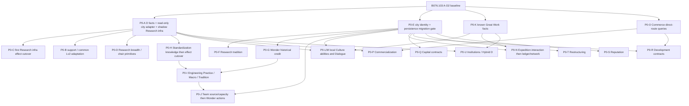

# D0032 v0.1 implementation dependency and migration plan

历史进度（原E1规划时点）：D3与U1前置原型用户PASS；B094单城自由城市持久映射恢复USER_GAME_TEST_PASS，见[E1验收范围](../../Status/Validation/Results/Specialization_B094_P0E1_Mapping_Pass.md)。不等于全路径身份/正式迁移通过；下一步收束支持范围并审阅E2具体计划，E2/F实施仍需授权。当前[E2具体计划](P0_E2_Plan.md)推荐先完成单城同Owner进度/投资保存切换；完整新城/跨Owner范围仍后置，不把首段等同完整E2。

当前用户范围：单人且仅本地人类玩家启用；外方持城全部专业休眠。后续只处理玩家失城/夺回与首次征服AI城，见E2计划的ELIG/PROG核对；不增加AI/多人依赖，保留Design未来通用资格。

Document Owner: Codex
Revision: A0160 planning gate, 2026-09-18
Authority: D0032; no Gameplay implementation authorized by this plan
Gate: GATE B — READY FOR P0-A (only after user authorization)

## 当前后续计划适用范围

本页起源于D0032/A0160门禁，下列早期进度/推荐P0-A属于历史，不能当今天的授权。当前任务仍是[Status CURRENT](../../Status/Specialization_P0_Status.md#current-authoritative-state)指向的B165 native待验。

商业O/P/Q/R/S/T采用[当前商业准备计划](Commerce_Preparation.md)，工业G/H/I/J采用[当前工业准备计划](Industry_Preparation.md)：已按Spec D0047及Commerce/Industry/Shared D0045重核。下表相关行更新为现行合同；旧target/spike里的已取代公式或deferred状态不再适用。共同迁移/单writer/UNKNOWN合同保留，具体实施仍须逐批授权；本次只调查与计划，没有新writer、部署或原生PASS。用户实机流程按现行W0004 native delta原则收敛，不机械重跑旧表全套load/退出步骤。

文化M/N/U2采用[当前文化准备](Culture_Preparation.md)：无额外Dialogue cap、未提交取消、见闻城市历史、考察归档易主/重挂靠、全国cap1与首测值已由Culture D0046/Shared D0045明确；旧计划中的相反规则不再是活动TBD。B165及各原语的技术门禁仍独立，不因本次重核增加实施/原生PASS。

## Implementation progress (2026-09-18)

P0-A B078: user confirms D and working-specialist reads; pillage untested. P0-B1 separately authorized and completed in B079.106: [scope, retirement and local evidence](P0_B1_Specialist_Support.md). Only existing basic support cutover; no new Research Infrastructure effect. P0-B1 local PASS and user-reported game PASS including Industry; see Status validation record. P0-B2 explicitly authorized and locally completed in B080.107; user-reported P0-B2 game PASS. A0160 plan and frozen Design rules are unchanged.

P0-B2具体计划：[Lv2住房/GPP资格](P0_B2_Plan.md)，LOCAL_SIMULATION_PASS，见[P0-B2实施报告](P0_B2_Lv2_Qualification.md)；不改变冻结规则，P0-C[具体计划](P0_C_Plan.md)已备，未授权实施。

## Dependency graph

| Layer/node | Depends on | Consumers / gate |
|---|---|---|
| L0 现有城市事实 / 商路生命周期 | A–D2 | 保留完整事实版本、有效性及发布合同 |
| L0 普通建筑 / Domain / D | 已支持目录及原生建筑、掠夺、reference | Research / Culture / Commerce共享事实，不共享能力公式 |
| L0 Great Work事实 | 已知作品目录、Era、location验证 | Culture各能力、任务目标、Hybrid D |
| L0 直接有向route索引 | 已验证snapshot / version | 商业化双向资格、发展投资签约outgoing |
| L1 cityKey / History / 保存 | 现有progression审计、transfer/schema原型 | 城市永久成果与合同，不自动恢复旧inheritance模块 |
| L1 专业成果 / 合同 / Team记录 | cityKey/currentRef、幂等原生操作证据 | 分专业明确writer，不建generic transaction framework |
| L2 modifier投影 / retirement | primitive证据、exclusive writer及旧effect清单 | 各能力结算；精度与叠加分接口确认 |
| L2 Network payload view | common topology与独立专业事实版本 | Industry union/max、Culture完整文明集合；合同不归topology所有 |
| L2 presentation read model | confirmed facts、成果及ability plan | 机构、Hybrid D、Commerce panel；hover不请求 |
| L3 简单本地能力 | D / workers / 普通建筑目录 / BASE | 基础支持、II、科研基础设施/学以致用/主持 |
| L4 历史 / 项目 / 单位 / 经济系统 | 专属保存、spike、已批准参数 | 传统、Dialogue、模板/Team、考察、投资/重组 |

Edges indicate prerequisites, not a profession-by-profession sequence. O can follow A without waiting for N; each later system waits only for its own gates. E is a focused planned prerequisite for new persistent semantics, **not permission to start the historical AV2 Batch E** or sweep receipt/cache/32-city work into A. A–D2 remain the completed runtime architecture line; D0032 application batches are a new implementation plan using that foundation.

## 实施批次合同

下面每个子批次均须单独授权，不把整张表当作实施许可。默认只在develop完成本地验证、commit/push；部署仍需另行授权。文件名表示责任落点，可以复用现有文件，不要求按表创建新框架。

**所有批次共同的完成定义**：正常模型无隐藏module error；重复/过期/UNKNOWN/确认失效/epoch验证通过；无关事件不产生昂贵工作；未涉及模块的输出不变；明确记录STATIC、LOCAL、USER证据，不把前两者称为实机PASS。

**每批回滚边界**：前一个干净commit、经授权保留的整包恢复点、切换前独立存档。涉及保存迁移的批次不得直接降级继续读已改写存档。下表的用户测试是未来候选，不是本轮测试要求；同一个小测试存档可跨批复用，但不把未实现的组件一起测。

| 批次 / Goal | Scope / 可能涉及模块 | 依赖 / 旧实现处理 | 静态及本地验收 | 最小未来实机测试 / Exit |
|---|---|---|---|---|
| **P0-A 事实纵切** | 普通建筑目录、Domain归一化、逐区域D、EffectiveFacts只读适配、RES_L4_INFRA纯影子plan、按需诊断 | B076；不退出旧writer，不新增持久状态 | D矩阵、同领域最高单区域、ACTIVE/worker状态；10k idle无扫描/发送/写入；无Building/Property/queue写入 | 一座科研城合并验证建筑、掠夺修复、专家及ACTIVE；仅补本地无法证明的原生事实。Exit：事实→consumer→diagnostic可靠 |
| P0-B1 全等级基础支持 | ResearchSupport / IndustrySupport / Lv3Support及其SQL清理 | A；保留3F3P或工业3F+BASE P，退出旧III额外支持 | 四专业ACTIVE1–4基础不变；工业不再附送旧Gold；UNKNOWN不清空 | 一个多城准备档调总督/专家即可。Exit：只改基础支持，不捎带新III能力 |
| P0-B2 Lv2资格 | Lv2Housing / GPP读取普通建筑、特色替代、掠夺及专家事实 | A/B1；保留按Tier存在性的Housing及2 base GPP，不把Housing换成加权D | 免费/特色/同Tier/掠夺矩阵；GPP进入原生base层；批次共享索引 | 一城建设/修复/调专家，Exit：II语义和资格一致 |
| P0-C 首个新收益切换 | 仅Research IV科研基础设施：D×working Research specialists Science | A及专家yield primitive；退出Research Lv4Percent和Research Copy分支，Industry Copy不动 | D/worker/ACTIVE矩阵；读档后旧载体为零；工业输出不变 | 一城D、专家、总督升降及读档；Exit：明确“Research IV部分完成”，主持/传统尚未实现 |
| P0-D1 科研跨领域BASE | RES_L3_CROSS纯plan及C2采样复用；九类非Campus已完成未掠夺区域 | A及小数接口验证；退出科研人口Lv3Effects | BASE与actual分离、特色归一、掠夺排除；不能直接重用旧actual Copy | 一城两个领域、政策相邻变化及掠夺；Exit：仅BASE能力 |
| P0-D2 学以致用 | D×0.5 Yield Share，按领域映射给科研专家 | A/D1；本批用户授权每名floor整数专家路径 | Gold×3、同产出领域相加、同领域取最高单区域 | 同城Gold/Production领域及专家变化；Exit：无旧人口效果叠加 |
| P0-D3 学术主持 | 每座合格普通Campus T1–4建筑按专家数加Science | A/C及逐建筑yield primitive | 逐建筑、不受D cap替代；免费/特色/掠夺recipient矩阵 | 同一IV城建筑明细与总量；Exit：主持独立完成 |
| P0-E1 城市身份保存门禁 | cityKey/currentRef、History/mode schema与只读迁移预演 | A；Binding/Journal/Flow/投资旧记录保留，不恢复隔离继承代码 | 原记录映射一致；冲突HELD；转移/夷平重建/ID复用 | 独立测试档一城转移/夺回/读档；Exit：证明城市连续性，不决定全部Legacy |
| P0-E2 进度保存适配 | Current Identity/Potential/History版本化；保留REALLOCATING独立状态位 | E1；迁移城市停止旧first-completion writer；不丢投资凭据 | 中断迁移幂等、REALLOCATING不走NONE、无carrier反推Potential | 独立档投资+读档；Exit：明确支持的旧档范围；尚无资产重组能力 |
| P0-F 学术传统 | eligible age、暂停/续算、ACTIVE收益门槛 | E2/C；旧专家百分比已退出 | 速度阈值分别floor、同回合读档不重复计龄、离开Research不补算 | 接近阈值的一城调总督+读档；Exit：传统，不擅自决定征服Legacy |
| P0-G 奇观完成证据 | [G现行计划](Industry_Preparation.md#g本城经验n与文明信用e不是同一账本)：真实城市N与实际完成文明own-era集合E，先无收益 | E2城市引用；从可信起点记录，无现持奇观反推、无缺史填0 | 非工业完成、同Era/重复/Owner分离、空与损坏、保存 | 新collector新增原生完成/保存delta；Exit仅可靠事实，不宣称工程能力 |
| P0-H1 标准化知识 | [H1知识增量](Industry_Preparation.md#h1知识增量)：建筑ledger可靠并集不变，补typed District模板 | 当前建筑reconcile与Store；不扩目标目录，不更改旧收益 | 首次/可靠空/缺史区别、replacement、区域增量、幂等 | 只补新区域记录/重载差异，继承B142建筑范围；Exit知识层 |
| P0-H2 标准化购买 | [H2/H3来源合同](Industry_Preparation.md#h2h3来源与目标计划)：self及合法网络ACTIVE>=III实际holder内purchase MAX，III0%/IV2L% | H1、可靠L、逐Gold/Faith合法资格、C1/D1协议；与H3正式基线切换时退出旧折扣/Industry Copy | 非holder不能放大模板、self/断路、逐渠道不新增许可、exact退出 | 新价格/退出delta；不能把旧10–40%或Faith fallback当当前规则 |
| P0-H3 标准化建设 | 合法普通建筑/区域，每模板actual-holder construction MAX；III10%/IV10+2L% | H1及建设原语；可先独立验证，再与H2一个正式基线cutover | 目录/特色/Wonder排除，与发展+50%加算及各自撤销 | 自身实际progress；R落地再补组合delta，不提前假造合同；Exit建设路径 |
| P0-I1/I2/I3 工程能力 | [三能力现行计划](Industry_Preparation.md#i三项工程能力分别接入)：Practice改队成本、Macro仅普通旧时代Wonder、Tradition为E→完整1T城市L | G/H/J对应原语，分批授权；不再以传统解锁T4/T5或Practice强化标准化 | N/E/L分权、L中断取消/保留已成、成本150/140/130/120、Macro10/20/30 | 每批只测新增原语；不把三项合成一次完整PASS |
| P0-J1 Team来源/容量 | [J1计划](Industry_Preparation.md#j1来源2槽与新成本)：III I–III/IV I–V，每source当前Owner存活本城出身队总2槽；成本与capacity分开 | E2/unit绑定/原生grant；不依赖E4/5；精确退出旧Lv1全档/无容量入口 | 同回合grant、满槽旧队列、消耗/撤退、Owner变化/夺回计槽与保存 | 新binding/容量/真实完成；不能静默删旧队列/已完成队；Exit可靠来源和库存 |
| P0-J2 Wonder施工 | [J2计划](Industry_Preparation.md#j2目标固定注入与保护)：Wonder-only、一次消耗、固定锁定capacity无普通Production buff/overflow、专业单位保护 | J1及固定注入/安全回归；不依赖Macro加成，普通建筑/区域授权退出 | 预览/重验、slot释放一次、未知执行不重放、无Owner转换 | 固定注入+下一目标无overflow、保护回归的新delta；完整正式入口非面板原型 |
| P0-K Great Work事实 | 已知作品目录、时代解析、city collection及国内时代索引 | A–D2协议；适配Dialogue producer；不改旧收益 | 未知作品排除、Artifact时代、移动两城、暂不可用/epoch | 一件作品在两城移动后读诊断；Exit事实层 |
| P0-L1/L2/L3 文化被动能力 | 分别风雅熏陶普通建筑Tourism、意义延展D份产出、D0049巨作启迪3%×当前E本城全类GPP | A/K及各primitive；L1退出旧Culture人口及worker%；L2退出旧GW adjacency；L3退役B168小数Probe | L1/L2资格保持；Meaning逐领域Floor不外推。L3无D/W/class排除，复用city百分比 | [当前L3合同](P0_L3_Inspiration.md#当前切片与停止点)：B172自动路径本地完成，原生待验；不把旧小数失败作为新百分比结论 |
| P0-M 时代对话项目 | [M计划](P0_M_Dialogue.md)：完整1T、START Era额度、完成X、城市累计5%×X无额外cap；未提交取消已定 | E2/K/真实项目及新累计native-only；替换旧25%(D−1)，保留采样/ACK职责 | 提交前取消无额度/半进度、成功后保留、完成样本/重复/原子保存；不放大Meaning | 新项目/累计/实际收益delta；新增持久块一个必要load边界，既有harness继承 |
| P0-N1/N2/N3 人文考察 | [N计划](P0_N_Expedition.md)：N1远程/来源/保护；N2城市历史与本城2%/有效见闻；N3每完整文明+1专家Culture | Spy等价成本/全国cap1/标准2T已定；重挂靠/外国事实/整体旅游/保存原语；仅N3退旧Culture Eureka | 战争/目标失效；归档易主abort/原主保留团；城市历史自身文明过滤；各source独立3/3后union | 各子批只验新原生差异，集合主要本地；新绑定保存才加对应load，Research不受切换影响 |
| P0-O 有向商路读服务 | [O计划](Commerce_Preparation.md#o只读资格三种路线关系分开)：同一verified snapshot direct incoming/outgoing/pair，只读 | 现Input/Bridge及已接受后台来源；不加provider、不改共同topology或旧收益 | 两方向/去重/异Owner/UNKNOWN/epoch/端点改变；distribution不替direct | 未改native来源可继承；Exit只读事实，不算商业落地 |
| P0-P 商业化 | [P1配置/P2效果](Commerce_Preparation.md#p与s配置当前效果与制度历史分开)：五域0.1DX、容量/order/LIFO暂停恢复，IV有效R | O/D/worker/配置/UI；COM-DETAIL-X与Gold原语后P2精确退3项COM+48Convergence | 最高source/非递归、同回合变化、配置退出、exact单writer；不套旧20%或Floor | 原生Gold真实结算、自动接入和改动的退出路径；P1无收益不能宣布P完成 |
| P0-Q1/Q2 资本合同 | [Q合同计划](Commerce_Preparation.md#q合同与隐藏保护有各自的持久权威)：Q1稳健25%余额/10T/具体S锁；Q2确认锁结果和更新pity | Q1需S池/level/空池/同域scope；Q2另需pity rebase/Owner；资金/原子恢复/UI原语 | 重复扣款/到期/quote、具体S选择、隐藏字段、合同Owner异常终止与pity分开 | 新Gold与锁定保存/结算delta；不机械让风险TBD阻塞safe技术准备 |
| P0-R 发展投资 | [R计划](Commerce_Preparation.md#r报价与签约后的合同独立)：IV/outgoing签约、标准15P_ref/10T/普通建筑+50%、专家容量 | O、P_low/无解决策及普通Production/资金原语；只需H3加算证明，不依赖全工业 | 签后断路/资格下降续存、target-domain唯一、关键Owner无退款终止并撤效果 | 新普通progress/合同终止/组合delta；Owner合同已定，特殊删除/非法target仍未决 |
| P0-S 商业信誉 | [S1记录](Commerce_Preparation.md#p与s配置当前效果与制度历史分开)：首次IV后标准Identity完整T+1/cap40；收益IV、Owner保留、Identity退出0 | E2业务专属保存；记录独立于P/Q，效果分别由P/Q消费；非标准速度未定 | 重复计龄/ACTIVE下降/Owner休眠/清Identity/缺史HELD，不能抄科研policy | 新记录生命周期delta；不再把已定增长/用途/Owner整体标待定 |
| P0-T1/T2 资产重组 | [T计划](Commerce_Preparation.md#t团队存续与绑定事务分别管理)：IV500P保护Team；P−1/REALLOCATING/5完整T/扰动/配置一次 | E2/Permanent debit及全部直接consumer；无需等待Q/R，但需专业保护/净余粮原语 | source provenance与bound target分离；目标Owner变毁未完成事务/team，历史不全删 | 新单位/扰动/持久事务delta；非标准速度及未涵盖处置不自填 |
| P0-U1/U2/U3 Presentation | U1当前/历史机构；[U2 Hybrid D](P0_U2_Culture_Era.md)按当前K组成/国内索引通知；U3 Commerce project入口与两个panel | 各自confirmed read model及UI hook；U3先fixture可测，正式confirm需真实owner | institution非Building、分阶段tooltip、hover零请求、队列不动、报价版本校验 | 对应一个城市/巨作/Commerce界面，检查当前及另一UI scale；不引入新玩法 |
| P0-V 集成门禁 | 四专业所选完整规则集、retirement、保存、性能矩阵 | 所有拟发布能力及参数门禁通过 | 无旧效果复活、normal无error、明确参数profile、回合/load/idle预算 | 一个混合城市准备档合并商路/专家/掠夺/回合/读档断言；长局内存另记趋势 |

未定参数可用明确标记的本地fixture完成纯plan或技术原型，不得作为默认正式游戏值发布。Commerce DESIGN_FROZEN不等于P/Q/R/S/T已具备全部实现输入。UI原型和对应contract owner可在相同依赖层分别开发；正式玩家功能的Exit必须二者都完成，避免“没有入口却宣布可玩”。

## 推荐第一批：P0-A事实纵切

1. 复用HD tier/replacement证据建立明确的普通建筑目录，记录分类来源、版本及排除原因；不改HD表。
2. 输出逐区域合格建筑贡献、cap后D、同领域最高单区域D。现有EffectiveFacts只做小型只读适配，不改永久权威。
3. **Gameplay侧**纯RES_L4_INFRA consumer在confirmed ACTIVE4时计算 `workingResearchSpecialists × CampusDomainD`。只是desired effect plan，**shadow only**，没有carrier或原生产出写入。
4. 一个按需诊断显示输入、排除原因、新plan及旧runtime配置。新旧Design公式不同，不能拿“数值必须相等”作为通过标准。不新增institution UI。
5. 本地覆盖D0/1/3/6/10、同Tier多栋、缺低Tier、免费/特色/掠夺/未完成/未知、多区域取最高、worker0/n、ACTIVE3/4/UNKNOWN、reference变化、direct dirty与有界回合兜底、10k idle零昂贵工作。

**明确不包含**：cityKey持久化、存档迁移、REALLOCATING写入、通用参与资格/32城修复、新yield carrier、退出旧收益、全Shared框架、Commerce UI/合同/平衡、Crew/Expedition、部署。P0-C才是首个真实新收益切换，必须先通过primitive及旧Research IV退出门禁。若要求首批直接施加收益，需要另行扩大授权，不能悄悄塞入A。

## Migration / cutover合同

1. **代码前**：每批列受影响effect IDs、writer入口、原生trait/project附着、保存Property及支持的存档范围。现在只做计划。
2. **Shadow**：新事实与plan不写Building/Property/yield/unit，旧consumer不把shadow当authority。诊断清楚标明新旧规则不同。
3. **切换准备**：参数齐备、primitive证据、UNKNOWN/确认撤销测试、exclusive writer断言。不为一个能力关闭四专业全部能力。
4. **Cutover**：单一版本化feature选择old或new的Start/dispatch/subscription。按allowlist清理旧载体/实验flag，确认完成后再启用新投影；清理不确定则新效果HELD。普通样本延迟不得重做这套清理。迁移标记阻止旧load/audit及隐藏测试按钮恢复旧效果。
5. **数据库**：声明支持旧档时保留可识别旧Type ID直至清理完成；不能先删定义再失去清理依据。审计不止Buildings，还包括trait条件Property、HD Boost Property、旧queue授予。新capacity生效时，旧排队Crew不能绕过来源/容量；不允许静默删除玩家队列。
6. **存档**：沿用Playtest Workflow，develop改写档不保证能降级继续。A不写新保存状态；后续历史系统默认建议新测试局，旧schema只有迁移证明及批次审批通过才支持。当前Wonder持有者、旧Dialogue载体不能反推历史完成者/次数；缺史UNKNOWN，不能造奖或伪装确定零值。不触碰旧baseline长局档。
7. **回滚**：整包恢复到前commit并使用切换前独立存档。只有已证明保存兼容的批次可沿用改写档；不在游戏存活时切数据库。commit/push不等于部署许可。
8. **退出验收**：读档、过回合、真实事件及旧手动control均不能恢复旧effect；新输出正确，未涉及载体不变。保留历史Design和测试代码，关闭正式执行入口。

## 明确的旧效果切换责任

| 旧writer / 输出 | 首个正式退出批次 | 清理与后续保护 |
|---|---|---|
| Lv3Support四专业额外支持，包括Industry Gold | B1 | 固定支持/Gold bits及所有Audit/控制入口；不删除Lv1基础支持 |
| Research Lv4Percent / Research Copy | C | 科研worker%和Copy正负/半点pieces；Industry分支不受牵连 |
| Research population Lv3Effects | D1 | Research人口bits；D2再补新学以致用 |
| Industry Copy 50%实际Production / 原10–40%折扣 | H正式基线cutover（H2/H3门禁后） | Industry Copy pieces与旧折扣selectors；H3尚未完成时明确为部分新Industry，不保留旧Copy补空缺 |
| Culture人口Lv3Effects / Culture Lv4Percent | L1 | 对应人口/worker% pieces；不会与风雅熏陶叠加 |
| GreatWorkAdjacency旧BASE逐件收益 | L2 | 全部带符号GW yield pieces、旧AdjData consumer；新Meaning不受旧公式影响 |
| Dialogue旧25%×(D−1) | M | D selectors与TEST25/50/100、旧控制及自动重建入口；不迁移成永久Dialogue成果 |
| Culture Eureka Network | N3 | Culture整数/legacy/test载体、HD Property投影及请求入口；保留RES-005当前授权的Research Inspiration |
| Commerce connected-kind与Convergence20% | P | COM kind pieces、48汇聚bits、incoming-only业务解释；common Trade Center topology保留 |
| Industry I无限项目Team入口 / 普通区域建筑施工 | J1 / J2 | J1控制native项目授予及旧队列边界；J2移除普通目标授权；历史代码保留 |
| 旧actual Copy UI producer | 最后一个旧Copy consumer退出后（Research Copy已退出且H正式基线cutover完成） | 关闭其采样/bridge发送，不误关其它BASE或独立诊断producer |
| 半点/购买/GW/trait实验效果 | 每个受影响能力cutover前检查 | 按明确flag/ID隔离，手动旧TEST不能越过新ruleset；不能仅凭按钮隐藏判断无效 |

这个表定义计划中的单writer责任，不代表本轮已执行清理。每批切换前仍要从源文件导出精确ID allowlist并按当前加载目录检查，不按前缀误删其它专业。

## Release / 未知策略

报告逐项列出启用的规则版本及未完成能力；混合开发态不是“v0.1 complete”。未来破坏性功能的ownership/Legacy缺口须在对应正式发布前审查，不自行选择取消/延续。B076已接受的自建城测试范围不因新文档自动扩大。参数待定、新Research Network deferred不阻塞A。

**历史A0160 Gate推荐：authorize P0-A implementation（不是当前授权）。** 本轮commit/push后停止，不自动写代码、执行历史Batch E、部署、tag或promotion。

## P0-D3验收后的顺序调整

用户要求提前规划U1，详见[P0-U1具体计划](P0_U1_Plan.md)。当前机构/阶段说明/技术carrier隐藏可复用已有事实先行；历史机构仍需Historical State，不随本次提前实施。U2/U3及其它Gameplay批次未获授权，原依赖与Design不变。

用户后续澄清：提前U1仅做技术可行性与显示效果原型计划，不要求提前完整交付当前机构。具体以P0_U1_Plan顶部为准；一个Research城/一个主要surface，完整U1依赖不变。
