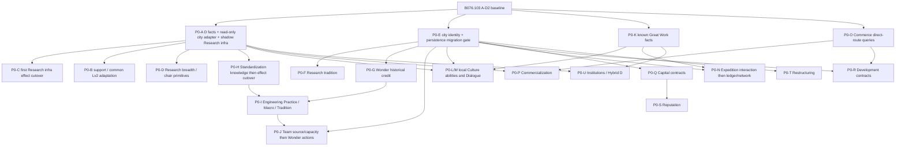

# D0032 v0.1 implementation dependency and migration plan

Document Owner: Codex
Revision: A0160 planning gate, 2026-09-18
Authority: D0032; no Gameplay implementation authorized by this plan
Gate: GATE B — READY FOR P0-A (only after user authorization)

## Implementation progress (2026-09-18)

P0-A B078: user confirms D and working-specialist reads; pillage untested. P0-B1 separately authorized and completed in B079.106: [scope, retirement and local evidence](P0_B1_Specialist_Support.md). Only existing basic support cutover; no new Research Infrastructure effect. P0-B1 local PASS and user-reported game PASS including Industry; see Status validation record. P0-B2 explicitly authorized and locally completed in B080.107; user-reported P0-B2 game PASS. A0160 plan and frozen Design rules are unchanged.

P0-B2具体计划：[Lv2住房/GPP资格](P0_B2_Plan.md)，LOCAL_SIMULATION_PASS，见[P0-B2实施报告](P0_B2_Lv2_Qualification.md)；不改变冻结规则，P0-C[具体计划](P0_C_Plan.md)已备，未授权实施。

## Dependency graph

| Layer/node | Depends on | Consumers / gate |
|---|---|---|
| L0 现有城市事实 / 商路生命周期 | A–D2 | 保留完整事实版本、有效性及发布合同 |
| L0 普通建筑 / Domain / D | 已支持目录及原生建筑、掠夺、reference | Research / Culture / Commerce共享事实，不共享能力公式 |
| L0 Great Work事实 | 已知作品目录、Era、location验证 | Culture各能力、任务目标、Hybrid D |
| L0 直接有向route索引 | 已验证snapshot / version | 商业化双向资格、发展投资签约outgoing |
| L1 cityKey / History / 保存 | 现有progression审计、transfer/schema原型 | 城市永久成果与合同，不自动恢复旧inheritance模块 |
| L1 专业成果 / 合同 / Team记录 | cityKey/currentRef、幂等原生操作证据 | 分专业明确writer，不建generic transaction framework |
| L2 modifier投影 / retirement | primitive证据、exclusive writer及旧effect清单 | 各能力结算；精度与叠加分接口确认 |
| L2 Network payload view | common topology与独立专业事实版本 | Industry union/max、Culture完整文明集合；合同不归topology所有 |
| L2 presentation read model | confirmed facts、成果及ability plan | 机构、Hybrid D、Commerce panel；hover不请求 |
| L3 简单本地能力 | D / workers / 普通建筑目录 / BASE | 基础支持、II、科研基础设施/学以致用/主持 |
| L4 历史 / 项目 / 单位 / 经济系统 | 专属保存、spike、已批准参数 | 传统、Dialogue、模板/Team、考察、投资/重组 |

Edges indicate prerequisites, not a profession-by-profession sequence. O can follow A without waiting for N; each later system waits only for its own gates. E is a focused planned prerequisite for new persistent semantics, **not permission to start the historical AV2 Batch E** or sweep receipt/cache/32-city work into A. A–D2 remain the completed runtime architecture line; D0032 application batches are a new implementation plan using that foundation.

## 实施批次合同

下面每个子批次均须单独授权，不把整张表当作实施许可。默认只在develop完成本地验证、commit/push；部署仍需另行授权。文件名表示责任落点，可以复用现有文件，不要求按表创建新框架。

**所有批次共同的完成定义**：正常模型无隐藏module error；重复/过期/UNKNOWN/确认失效/epoch验证通过；无关事件不产生昂贵工作；未涉及模块的输出不变；明确记录STATIC、LOCAL、USER证据，不把前两者称为实机PASS。

**每批回滚边界**：前一个干净commit、经授权保留的整包恢复点、切换前独立存档。涉及保存迁移的批次不得直接降级继续读已改写存档。下表的用户测试是未来候选，不是本轮测试要求；同一个小测试存档可跨批复用，但不把未实现的组件一起测。

| 批次 / Goal | Scope / 可能涉及模块 | 依赖 / 旧实现处理 | 静态及本地验收 | 最小未来实机测试 / Exit |
|---|---|---|---|---|
| **P0-A 事实纵切** | 普通建筑目录、Domain归一化、逐区域D、EffectiveFacts只读适配、RES_L4_INFRA纯影子plan、按需诊断 | B076；不退出旧writer，不新增持久状态 | D矩阵、同领域最高单区域、ACTIVE/worker状态；10k idle无扫描/发送/写入；无Building/Property/queue写入 | 一座科研城合并验证建筑、掠夺修复、专家及ACTIVE；仅补本地无法证明的原生事实。Exit：事实→consumer→diagnostic可靠 |
| P0-B1 全等级基础支持 | ResearchSupport / IndustrySupport / Lv3Support及其SQL清理 | A；保留3F3P或工业3F+BASE P，退出旧III额外支持 | 四专业ACTIVE1–4基础不变；工业不再附送旧Gold；UNKNOWN不清空 | 一个多城准备档调总督/专家即可。Exit：只改基础支持，不捎带新III能力 |
| P0-B2 Lv2资格 | Lv2Housing / GPP读取普通建筑、特色替代、掠夺及专家事实 | A/B1；保留按Tier存在性的Housing及2 base GPP，不把Housing换成加权D | 免费/特色/同Tier/掠夺矩阵；GPP进入原生base层；批次共享索引 | 一城建设/修复/调专家，Exit：II语义和资格一致 |
| P0-C 首个新收益切换 | 仅Research IV科研基础设施：D×working Research specialists Science | A及专家yield primitive；退出Research Lv4Percent和Research Copy分支，Industry Copy不动 | D/worker/ACTIVE矩阵；读档后旧载体为零；工业输出不变 | 一城D、专家、总督升降及读档；Exit：明确“Research IV部分完成”，主持/传统尚未实现 |
| P0-D1 科研跨领域BASE | RES_L3_CROSS纯plan及C2采样复用；九类非Campus已完成未掠夺区域 | A及小数接口验证；退出科研人口Lv3Effects | BASE与actual分离、特色归一、掠夺排除；不能直接重用旧actual Copy | 一城两个领域、政策相邻变化及掠夺；Exit：仅BASE能力 |
| P0-D2 学以致用 | D×0.5 Yield Share，按领域映射给科研专家 | A/D1及专家小数primitive | Gold×3、同产出领域相加、同领域取最高单区域 | 同城Gold/Production领域及专家变化；Exit：无旧人口效果叠加 |
| P0-D3 学术主持 | 每座合格普通Campus T1–4建筑按专家数加Science | A/C及逐建筑yield primitive | 逐建筑、不受D cap替代；免费/特色/掠夺recipient矩阵 | 同一IV城建筑明细与总量；Exit：主持独立完成 |
| P0-E1 城市身份保存门禁 | cityKey/currentRef、History/mode schema与只读迁移预演 | A；Binding/Journal/Flow/投资旧记录保留，不恢复隔离继承代码 | 原记录映射一致；冲突HELD；转移/夷平重建/ID复用 | 独立测试档一城转移/夺回/读档；Exit：证明城市连续性，不决定全部Legacy |
| P0-E2 进度保存适配 | Current Identity/Potential/History版本化；保留REALLOCATING独立状态位 | E1；迁移城市停止旧first-completion writer；不丢投资凭据 | 中断迁移幂等、REALLOCATING不走NONE、无carrier反推Potential | 独立档投资+读档；Exit：明确支持的旧档范围；尚无资产重组能力 |
| P0-F 学术传统 | eligible age、暂停/续算、ACTIVE收益门槛 | E2/C；旧专家百分比已退出 | 速度阈值分别floor、同回合读档不重复计龄、离开Research不补算 | 接近阈值的一城调总督+读档；Exit：传统，不擅自决定征服Legacy |
| P0-G 奇观完成证据 | 从开局记录实际完成城市/文明、Wonder自身时代 | E1；先无新收益 | 重复事件、成为Industry前完成、征服不记新完成、缺史UNKNOWN | 新测试档先完成奇观后升专业；Exit：历史事实，不是工程能力已完成 |
| P0-H1 标准化知识 | 扩展现有ledger为建筑/区域typed templates，目录策略独立于普通建筑本体 | A/E1；Standardization/Catalog适配，旧知识不凭空重分组 | 合法获取/补录、掠夺后历史保留、特色匹配、目录迁移 | 工业城完成建筑及区域后核对ledger；Exit：知识层 |
| P0-H2 标准化购买 | III资格、模板并集、独立最高购买效率；保留C1/D1协议 | H1及已定参数；退出旧10–40%selectors及Industry Copy的50%实际Production分支 | 知识来源与最高效率来源不同；不新增Gold/Faith资格 | 两来源与一个购买目标，断路/读档；Exit：购买路径 |
| P0-H3 标准化建设 | 独立普通建筑/区域建设投影，最高建设效率 | H1及生产primitive/参数；当前runtime没有完整此路径 | 与购买效率独立；匹配范围及原生叠加；无成本/购买副作用 | 两来源一个建设目标；Exit：建设路径，可供发展投资共存测试 |
| P0-I1/I2/I3 工程能力 | 分别做工程实践效率、巨构工程学正常生产/Team注入、工程传统T4/T5门槛 | G/H及各自曲线/时代/注入spike；三项必须分批 | 完成归属、不同Era语义、max非相加、旧时代Wonder补齐、注入只计算一次 | 每批复用一个Wonder准备档；Exit分别记录，不能一次声称三项完成 |
| P0-J1 Team来源/容量 | 项目完成绑定训练城，capacity2，各Tier1slot；III/IV分层生产资格 | E1；高Tier还需I3，T1–3可先验证；退出Industry I无容量授予路径 | 同回合多完成、排队/完成门禁、重复事件、读档；ACTIVE下降/转专业不删旧队 | 一城完成两队→第三队受限→合法消耗释放槽位；Exit来源和容量。捕获/易主策略仍须另审 |
| P0-J2 Wonder施工 | Wonder-only目标、一次消耗、释放source slot、巨构工程学注入 | J1/I2；退出普通建筑/区域施工分支 | 预览/确认重验、溢出浪费、速度floor、不确定AddProgress不重放 | 一个Wonder目标消耗一队并读档；Exit完整新施工链 |
| P0-K Great Work事实 | 已知作品目录、时代解析、city collection及国内时代索引 | A–D2协议；适配Dialogue producer；不改旧收益 | 未知作品排除、Artifact时代、移动两城、暂不可用/epoch | 一件作品在两城移动后读诊断；Exit事实层 |
| P0-L1/L2/L3 文化被动能力 | 分别风雅熏陶普通建筑Tourism、意义延展D份产出、巨作启迪0.1D base GPP | A/K及每条primitive；L1退出旧Culture人口及worker%；L2退出旧GW adjacency；L3不另覆盖已完成L1/L2 | native与追加分层、普通建筑掠夺、作品池、领域/GPP映射；不自行floor | 同一馆藏城含两领域，每批只加入一种效应；0.1未证实不得宣布L3完成 |
| P0-M 时代对话项目 | 连续完整生产回合、START Era quota、完成时X、city ledger及native-only倍率 | E1/K及项目/收益隔离spike、cap参数；替换旧25%(D−1) | 高P/中断/跨时代/X0/重复/读档/易主quota；不放大意义延展 | 高P一城中断后完成、移动作品、读档；转移quota另做最小补测 |
| P0-N1/N2/N3 人文考察 | N1交互原型；N2来源绑定、原Owner记录及整城Tourism；N3 Culture Network | E1/K、Spy-like与Tourism原型、K参数；仅N3退出旧Culture Eureka | 战争/目标失效、固定成功保留单位、来源降级继续任务、3N唯一性；source各自3/3后union | 外国capital兼有GW/Wonder，单任务+战争/读档；集合并集主要本地验证，三子批独立完成 |
| P0-O 有向商路读服务 | 同一verified snapshot建立直接incoming/outgoing索引 | 原NetworkInput/Bridge；不加provider、不改旧Commerce收益 | A→B/B→A商业化均合法，发展投资仅outgoing；center distribution不当direct | 若无新原生事件，一般无需额外实机；Exit只读qualification |
| P0-P 商业化 | 先LIFO/capacity/Toggle事实；source value mapping及K批准后才启用Gold效果 | A/O、Commerce持久order和UI入口；退出COM connected-kind及Convergence | 存读档order、容量下降、最高source、不扣sourceyield、不套20% | 一城两专家两领域、单向路线；Exit须已定义mapping，不使用猜测数值 |
| P0-Q1/Q2 资本合同 | Q1稳健扣款/到期；Q2锁定风险结果及source-city pity | E1、settlement原型及报价参数、U3入口 | 重复确认/到期、部分写HELD、禁止重roll、跨领域同城pity、UI隐藏结果 | 一笔接近到期合同存读档；Q2另验证locked outcome；分批Exit |
| P0-R 发展投资 | outgoing只检查签约，持久条款，对目标领域普通建筑加生产 | E1/O、H3 primitive与TS05、参数/叠加、U3入口 | 断路不改变旧合同/期限；无路不能新签；目标专业可不同 | 一合同断路→回合→到期及非普通对象排除；易主/Legacy未定不擅自选择 |
| P0-S 商业信誉 | 独立age/stage及Design指定效率consumer | E1/P/Q、具体作用/增长/Legacy决定 | 不购买信誉、不反向惩罚好运、不复制科研阈值 | 接近阈值只核对指定报价变化；未定输入使本批效果待授权，不阻塞A |
| P0-T1/T2 资产重组 | T1生产专属Team与growth原型；T2持久两阶段P→P−1事务 | E2、相关spike、最低期速度规则、单位丢失/ownership边界 | P>=2、完整最低期、非NONE、旧source关闭、history暂停、配置一次消耗、部分写/丢队 | 相邻两个区域证明不能提前完成，转换中读档；不自动发救援Team |
| P0-U1/U2/U3 Presentation | U1当前/历史机构；U2 Hybrid D；U3 Commerce project入口与两个panel | 各自confirmed read model及UI hook；U3先fixture可测，正式confirm需真实owner | institution非Building、分阶段tooltip、hover零请求、队列不动、报价版本校验 | 对应一个城市/巨作/Commerce界面，检查当前及另一UI scale；不引入新玩法 |
| P0-V 集成门禁 | 四专业所选完整规则集、retirement、保存、性能矩阵 | 所有拟发布能力及参数门禁通过 | 无旧效果复活、normal无error、明确参数profile、回合/load/idle预算 | 一个混合城市准备档合并商路/专家/掠夺/回合/读档断言；长局内存另记趋势 |

未定参数可用明确标记的本地fixture完成纯plan或技术原型，不得作为默认正式游戏值发布。Commerce DESIGN_FROZEN不等于P/Q/R/S/T已具备全部实现输入。UI原型和对应contract owner可在相同依赖层分别开发；正式玩家功能的Exit必须二者都完成，避免“没有入口却宣布可玩”。

## 推荐第一批：P0-A事实纵切

1. 复用HD tier/replacement证据建立明确的普通建筑目录，记录分类来源、版本及排除原因；不改HD表。
2. 输出逐区域合格建筑贡献、cap后D、同领域最高单区域D。现有EffectiveFacts只做小型只读适配，不改永久权威。
3. **Gameplay侧**纯RES_L4_INFRA consumer在confirmed ACTIVE4时计算 `workingResearchSpecialists × CampusDomainD`。只是desired effect plan，**shadow only**，没有carrier或原生产出写入。
4. 一个按需诊断显示输入、排除原因、新plan及旧runtime配置。新旧Design公式不同，不能拿“数值必须相等”作为通过标准。不新增institution UI。
5. 本地覆盖D0/1/3/6/10、同Tier多栋、缺低Tier、免费/特色/掠夺/未完成/未知、多区域取最高、worker0/n、ACTIVE3/4/UNKNOWN、reference变化、direct dirty与有界回合兜底、10k idle零昂贵工作。

**明确不包含**：cityKey持久化、存档迁移、REALLOCATING写入、通用参与资格/32城修复、新yield carrier、退出旧收益、全Shared框架、Commerce UI/合同/平衡、Crew/Expedition、部署。P0-C才是首个真实新收益切换，必须先通过primitive及旧Research IV退出门禁。若要求首批直接施加收益，需要另行扩大授权，不能悄悄塞入A。

## Migration / cutover合同

1. **代码前**：每批列受影响effect IDs、writer入口、原生trait/project附着、保存Property及支持的存档范围。现在只做计划。
2. **Shadow**：新事实与plan不写Building/Property/yield/unit，旧consumer不把shadow当authority。诊断清楚标明新旧规则不同。
3. **切换准备**：参数齐备、primitive证据、UNKNOWN/确认撤销测试、exclusive writer断言。不为一个能力关闭四专业全部能力。
4. **Cutover**：单一版本化feature选择old或new的Start/dispatch/subscription。按allowlist清理旧载体/实验flag，确认完成后再启用新投影；清理不确定则新效果HELD。普通样本延迟不得重做这套清理。迁移标记阻止旧load/audit及隐藏测试按钮恢复旧效果。
5. **数据库**：声明支持旧档时保留可识别旧Type ID直至清理完成；不能先删定义再失去清理依据。审计不止Buildings，还包括trait条件Property、HD Boost Property、旧queue授予。新capacity生效时，旧排队Crew不能绕过来源/容量；不允许静默删除玩家队列。
6. **存档**：沿用Playtest Workflow，develop改写档不保证能降级继续。A不写新保存状态；后续历史系统默认建议新测试局，旧schema只有迁移证明及批次审批通过才支持。当前Wonder持有者、旧Dialogue载体不能反推历史完成者/次数；缺史UNKNOWN，不能造奖或伪装确定零值。不触碰旧baseline长局档。
7. **回滚**：整包恢复到前commit并使用切换前独立存档。只有已证明保存兼容的批次可沿用改写档；不在游戏存活时切数据库。commit/push不等于部署许可。
8. **退出验收**：读档、过回合、真实事件及旧手动control均不能恢复旧effect；新输出正确，未涉及载体不变。保留历史Design和测试代码，关闭正式执行入口。

## 明确的旧效果切换责任

| 旧writer / 输出 | 首个正式退出批次 | 清理与后续保护 |
|---|---|---|
| Lv3Support四专业额外支持，包括Industry Gold | B1 | 固定支持/Gold bits及所有Audit/控制入口；不删除Lv1基础支持 |
| Research Lv4Percent / Research Copy | C | 科研worker%和Copy正负/半点pieces；Industry分支不受牵连 |
| Research population Lv3Effects | D1 | Research人口bits；D2再补新学以致用 |
| Industry Copy 50%实际Production / 原10–40%折扣 | H2 | Industry Copy pieces与旧折扣selectors；H3尚未完成时明确为部分新Industry，不保留旧Copy补空缺 |
| Culture人口Lv3Effects / Culture Lv4Percent | L1 | 对应人口/worker% pieces；不会与风雅熏陶叠加 |
| GreatWorkAdjacency旧BASE逐件收益 | L2 | 全部带符号GW yield pieces、旧AdjData consumer；新Meaning不受旧公式影响 |
| Dialogue旧25%×(D−1) | M | D selectors与TEST25/50/100、旧控制及自动重建入口；不迁移成永久Dialogue成果 |
| Culture Eureka Network | N3 | Culture整数/legacy/test载体、HD Property投影及请求入口；保留RES-005当前授权的Research Inspiration |
| Commerce connected-kind与Convergence20% | P | COM kind pieces、48汇聚bits、incoming-only业务解释；common Trade Center topology保留 |
| Industry I无限项目Team入口 / 普通区域建筑施工 | J1 / J2 | J1控制native项目授予及旧队列边界；J2移除普通目标授权；历史代码保留 |
| 旧actual Copy UI producer | 最后一个旧Copy consumer退出后（C与H2均完成） | 关闭其采样/bridge发送，不误关其它BASE或独立诊断producer |
| 半点/购买/GW/trait实验效果 | 每个受影响能力cutover前检查 | 按明确flag/ID隔离，手动旧TEST不能越过新ruleset；不能仅凭按钮隐藏判断无效 |

这个表定义计划中的单writer责任，不代表本轮已执行清理。每批切换前仍要从源文件导出精确ID allowlist并按当前加载目录检查，不按前缀误删其它专业。

## Release / 未知策略

报告逐项列出启用的规则版本及未完成能力；混合开发态不是“v0.1 complete”。未来破坏性功能的ownership/Legacy缺口须在对应正式发布前审查，不自行选择取消/延续。B076已接受的自建城测试范围不因新文档自动扩大。参数待定、新Research Network deferred不阻塞A。

**Recommended next action: authorize P0-A implementation.** 本轮commit/push后停止，不自动写代码、执行历史Batch E、部署、tag或promotion。
