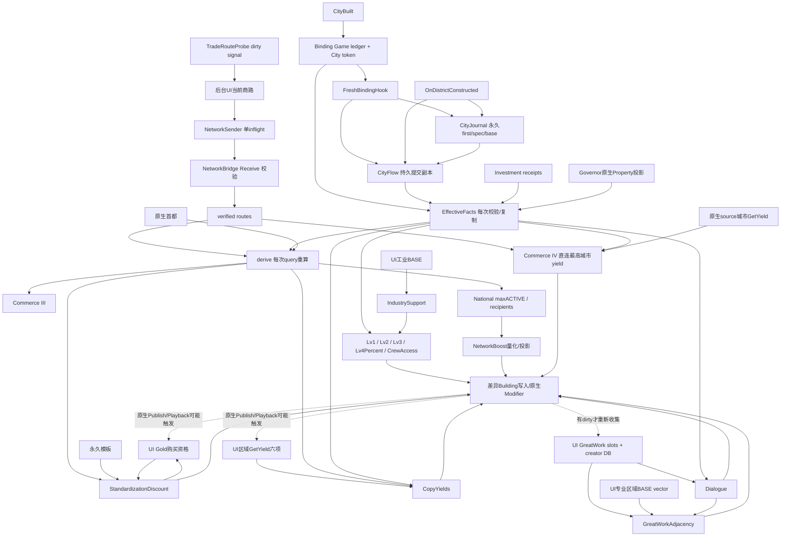
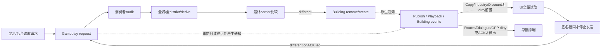

# Runtime Dependency Graph + UI ↔ Gameplay Bridge Map

Document Owner: Codex
Evidence: STATIC_CONFIRMED; native callback delivery/reentrancy timing not newly tested.

## 1. 实际主依赖图

箭头表示实际读/通知，不意味着统一revision或一次事务。Industry BASE、Copy actual、GreatWork BASE是不同输入，不能为了共用数据将三者混为一类。Commerce IV直接读已验证routes和source城市总yield，不经National、不从其它Commerce IV输出递归收敛。

## 2. 逐依赖证据及重复计算

| Upstream | Downstream | Reads | Notification | Scan scope | Shared / repeat | Evidence |
| --- | --- | --- | --- | --- | --- | --- |
| CityBuilt | Binding→FreshHook→Journal→Flow | 新城端点/token/首次空白journal | 同步callback包装，Start顺序重要 | 首次无ledger检查玩家城市；Journal扫描玩家district | 无统一commit通知 | [FreshBindingHook.lua:10](../../../Mod/FreshBindingHook.lua) |
| OnDistrictConstructed | Journal→Flow→ResearchSupport | 完成事件对象/type/历史first | 同事件分开listener依次执行 | family映射/目标验证；Flow再读Journal | 依赖顺序，不是一个事实事务 | [CityFlowProbe.lua:82](../../../Mod/CityFlowProbe.lua) |
| Binding+Journal+Flow+投资 | EffectiveFacts | 读联合确认与receipt count | pull函数调用 | deep clone/ledger validation；无native全城scan | 每个调用重新读 | [EffectiveFacts.lua:13](../../../Mod/EffectiveFacts.lua) |
| 原生Governor SQL property | EffectiveFacts | control/established/title flags | 原生modifier更新；各consumer各自监听Governor | 每读6flags；potential1跳gate | 无ACTIVE revision缓存 | [Probe.lua:302](../../../Mod/Probe.lua) |
| EffectiveFacts | ResearchSupport/Housing/GPP/Lv3/Lv4/CrewAccess | spec/active/first/potential | 各自事件和load Audit | 每城反复扫玩家district/检查carrier | 不共享district index/facts | [Lv2GPP.lua:27](../../../Mod/Lv2GPP.lua) |
| UI current routes | NetworkBridge | 完整端点/trader集合 | Request→Receive→notify | UI逐城routes；Game数目/端点/derive | 相同fingerprint抑制publication | [NetworkBridge.lua:50](../../../Mod/NetworkBridge.lua) |
| TradeRouteProbe signals | BackgroundRoutes | RouteSignalRevision变化 | generic flush observeGame | dirty才full scan | pending已合并；signal非route revision | [UI/BackgroundRoutes.lua:133](../../../Mod/UI/BackgroundRoutes.lua) |
| EffectiveFacts+capital+routes | Network derive | sources/centers/recipients | Receive/Rebuild/任一query | 每次遍历所有本玩家城市 | stored derived并非query共享cache | [NetworkBridge.lua:96](../../../Mod/NetworkBridge.lua) |
| Network derive | National→NetworkBoost | 去重recipient/max ACTIVE | route notify / direct Governor/turn / GPP dirty | National重新derive并对每recipient-source再读facts | 重复derive | [NetworkBoost.lua:35](../../../Mod/NetworkBoost.lua) |
| Network derive | ConnectedKinds→Commerce III | 本center direct types | route notify/各种Audit | 每个Commerce城重新derive | 重复derive | [Lv3Effects.lua:34](../../../Mod/Lv3Effects.lua) |
| Network derive+Templates | StandardizationDiscount.Plan | recipient sources、group union、maxLevel | route notify / GameCorePublish / Governor/turn | 每个城市RecipientSources重新derive，source ledger反复校验 | 只有最终plan signature共享给UI | [StandardizationDiscount.lua:15](../../../Mod/StandardizationDiscount.lua) |
| Network routes+source native GetYield | Commerce IV | direct incoming最高S/C/P基数 | route notify+Governor/worker/pop/turn/building | 每个目的城扫routes/facts；外层全世界 | 不调用Network derive；所有plans先算后写 | [CommerceConvergence.lua:9](../../../Mod/CommerceConvergence.lua) |
| UI BASE工业样本 | IndustrySupport→Lv3Support | identity工业区Base P | INDUSTRY_BASE→全局Audit | UI扫district，Game验证又扫；之后全城 | sent只抑制传输不抑制扫描 | [IndustrySupport.lua:62](../../../Mod/IndustrySupport.lua) |
| IndustrySupport Audit | CrewProjects | 工业资格（不需BASE） | 无条件直接调用 | 再全世界城市/玩家district | 冗余依赖BASE刷新 | [IndustrySupport.lua:59](../../../Mod/IndustrySupport.lua) |
| UI GPP dirty | GPP/Lv3Support/Lv3Effects/Boost/Dialogue | 无数据，要求重新读取 | LV2_GPP_DIRTY dispatch | 多份Audit/重复facts/network | UI dirty合并，消费端未共享 | [Gameplay.lua:215](../../../Mod/Gameplay.lua) |
| Lv3Effects Audit | Lv4Percent + CopyYields | 同事实，各自重读 | 每次末尾无条件调用 | 再次全城/district/network | 未比较上游变化就传播 | [Lv3Effects.lua:79](../../../Mod/Lv3Effects.lua) |
| UI district GetYield | CopyYields | 非学院全部区域total、工业P | COPY_YIELD_SAMPLE / lifecycle Audit | UI全district×6；Receive验证；每target sample又重扫district | signature在UI扫描后比较 | [CopyYields.lua:98](../../../Mod/CopyYields.lua) |
| Network recipient sources | CopyYields Industry | 每个接收城最高工业4源 | query拉取；Lv3Effects链间接通知 | 每城重新derive；每源facts | 不共享recipient facts | [CopyYields.lua:48](../../../Mod/CopyYields.lua) |
| Copy/Discount/Dialogue carrier writes | GameCore UI pulses | 原生Modifier/UI刷新 | 引擎可能Publish/Playback/Building事件 | UI Copy/Industry/Discount可能再scan | busy只阻止同步重入，不阻止以后pulse | [UI/CopyYieldRefresh.lua:57](../../../Mod/UI/CopyYieldRefresh.lua) |
| Standardization acquired building | Permanent learned | 目录中合法已持有building | Queue→Flush；discover初始化 | building事件常精确，AddedToMap扩展本玩家全城 | pending合并，unchanged不写 | [Standardization.lua:86](../../../Mod/Standardization.lua) |
| Discount plan | UI purchase check→discount Receive | targets/revision→allowed bits | ExposedMembers + request/seq ACK | UI逐candidate CanStartCommand；Receive前后各Audit | plan signature晚比较；样本turn敏感 | [UI/DiscountEligibility.lua:38](../../../Mod/UI/DiscountEligibility.lua) |
| UI Great Work slots | Dialogue collection | work ID/type + city EMPTY sentinel | DIALOGUE_SAMPLE→Receive | UI所有城市全部Buildings/slots；Game重新city set | 按dirty收集，seq ACK bounded retry | [UI/DialogueRefresh.lua:37](../../../Mod/UI/DialogueRefresh.lua) |
| Collection+DB creator era+ACTIVE | Dialogue→native GW percent | D count与25%(D−1) | Receive或Governor/turn/GPPdirty | 每次本玩家全城Plan/carrier检查 | 纯Plan不共享last作为authority | [Dialogue.lua:22](../../../Mod/Dialogue.lua) |
| UI BASE six-yield vector+collection | GreatWorkAdjacency | 每城RequiresPopulation区相邻总和/作品数量 | same DIALOGUE_SAMPLE AdjData；Dialogue.Audit调用 | Game重新district集合；全city检查carrier | 同包但先Dialogue Audit，再GWA Receive，非原子 | [Dialogue.lua:80](../../../Mod/Dialogue.lua) |
| 当前单位/queue/facts | UnitTargets→UnitActionView | 合法地块和预览 | selection timer requests / prepare/confirm | 目标全本玩家城市和district；HD plots | 共享回复而非执行权 | [UnitTargets.lua:5](../../../Mod/UnitTargets.lua) |
| HD UI queue helpers | ConstructionProbe→Crew | 当前cost/progress/current target | ExposedMembers.DLHD.Utils同步函数调用 | target前后校验 | 没有SPC seq/ACK；同步adapter | [ConstructionProbe.lua:17](../../../Mod/ConstructionProbe.lua) |
| Confirm投资/施工 | Permanent receipts / engine changes + consumers | unit debit、Potential或AddProgress | Gameplay显式多个Audit + engine事件 | 即使prepare也触发多个audits | 不按结果diff精确传播 | [Gameplay.lua:196](../../../Mod/Gameplay.lua) |
| 城市选择UI | EffectiveFacts→CityPresentationView | Potential投影 | 2s read-only request | 单城facts；request自身可引擎通知 | 无revision前置check | [UI/CityPotential.lua:45](../../../Mod/UI/CityPotential.lua) |
| 诊断点击 | Reports / read-triggered validation | 各模块view/native tooltip | SPC_P0_Request / Exposed direct read | 部分Read执行derive/Verified；日志手动dump | “read”不等于无计算/绝对无内存变化 | [NetworkBridge.lua:184](../../../Mod/NetworkBridge.lua) |

最显著重复：`RecipientSources(pid,city)`每次derive全网络；折扣/工业复制各城分别调用；`ConnectedKinds`和`National`另起derive。NetworkBridge保存的sources/centers/recipients并未供这些查询直接复用。当前route revision不覆盖ACTIVE/首都/身份，因此TARGET必须先定义多输入revision，不能直接以旧revision加缓存。

## 3. 跨Context接口合同

全局Transport T = `UI.RequestPlayerOperation(pid, PlayerOperations.EXECUTE_SCRIPT, {OnStart='SPC_P0_Request',Action,Token,...})` → Gameplay唯一GameEvents入口（Gameplay.lua:348）→Action分流。入口Token≤100字符，细字段由各接收者校验。`ExposedMembers`共享视图不是保存文件；不是每个表都防外部修改。没有统一ACK、重试或epoch协议。

| Producer context | Data / action | Transport / receiver | Validation | ACK / Retry | Cache | Consumer / authority |
|---|---|---|---|---|---|---|
| BackgroundRoutes UI + NetworkSender | 完整scalar endpoint/trader集 NETWORK_PUSH | T→NetworkBridge.Receive | version(sender)/epoch/seq/turn/signal/size/count/native count/端点/唯一trader | receiver seq是接收ACK非成功ACK；sender再核fingerprint，单inflight；同回合未ACK抑制，跨回合释放；collector失败最多3次 | lastverified snapshot、flight、fingerprint | 批准的当前route input adapter；无需玩家开UI，不以TradeEvents作为事实 |
| BackgroundRoutes UI | NETWORK_REVALIDATE_FAILURE | T→CheckEvidence(true) | test player+epoch，重新检查native证据 | 无独立ACK/循环retry | 无payload历史 | 明确失效证据时撤销；失败本身不等于失效 |
| CopyYieldRefresh UI | district total six yields / production; COPY_YIELD_SAMPLE | T→CopyYields.Receive | generation/seq/turn/完整current district set/finite values/size | receiver seq ACK；发送前sent签名；ACK不符可每pulse再发送新seq，无单flight/统一retry上限 | perplayer样本当回合；UI签名 | 当前批准actual basis adapter；非纯诊断，可Building writes |
| IndustryRefresh UI | BASEProduction + city/district INDUSTRY_BASE | T→IndustrySupport.Receive | test owner/industrial complete/current ID/value−1或0..255integer | 无独立ACK、epoch、turn、seq校验；只有请求抛错重置sent | UI sent live-prune；Game samples pid:cid | BASE input adapter→Industry Lv1/Lv3；重复扫描后才比值 |
| DiscountEligibility UI | CanStartCommand Gold allowed bits | T→DISCOUNT_INIT/ELIGIBILITY→StandardizationDiscount | generation/seq/plan revision/turn/完整targets | seq receipt ACK；signature比较在资格全扫后；无单flight上限 | plan revision + same-turn sample | Gold资格adapter，正式折扣；不授予Gold资格，不把价格作模板事实 |
| GPPRefresh UI | LV2_GPP_DIRTY，无workers/yield | T→Gameplay批量Audit | test player/module存在 | 无ACK字段；busy防同步；发送抛错dirty重置 | bool dirty | 是通知，不是权威数据；驱动GPP/Lv3/Boost/Dialogue，再连Copy/Lv4 |
| DialogueRefresh UI | city/work id/type+AdjData BASE vector DIALOGUE_SAMPLE | T→Dialogue.Receive→GWA.Receive | generation/seq/turn/size/唯一work/完整city；GWA另验证district/type/count | 先seq ACK防初始化重发风暴；最多2次同包重传，每3pulse触发；下一回合重新采样 | 单pending packet；样本按turn；dirty/revision | 当前collection/BASE adapter；不是作品intrinsic setter。先Dialogue.Audit再GWA.Receive，可能两次GWA audit |
| BoostRefresh UI | BOOST_INIT | T→EnsureReady/Clean GW probe | version/test player/ready | ready条件停止；未ready可每pulse重试，无计次上限 | busy | 启动兼容桥，不提供Boost数值 |
| HD外部UI Utils | queue cost/progress / GetCityPlots | ExposedMembers.DLHD.Utils同步调用→ConstructionProbe/UnitTargets | owner/type/current queue前后相等；地块owner/HD wonder property | 同步返回/pcall，无SPC ACK | 当前调用局部结果 | 已存在原生数据adapter；兼容展开列后续，不另实现 |
| UnitPanelActions UI | UNIT_ACTION_VIEW | T→UnitActions.ReadView | selected unit/owner/live facts/position/queue；reply token | 单viewToken；2s超时，0.5s下一请求；view有效1.5s | 单view及pending | 显示输入不是扣款权；ReadView可能取消过期内存plan，不写永久成果 |
| UnitPanelActions UI / 隐藏UnitSites | PREPARE/CONFIRM；旧SPAWN实验 | T→UnitActions.Run / InvestmentAction | 原生再次校验owner/unit/turn/target/progress/token；消耗流程单busy | LastToken/Snapshot ACK；10s超时不自动重发不可逆确认 | 单plan/pid、receipt永久 | 正式行为由Gameplay控制；prepare/confirm分离；不从UI lens决定扣款 |
| UnitTargetMarkers UI | UNIT_TARGETS_READ / builderPreview | T→UnitTargets.Refresh | unit/test player/live facts/current queue/location | snapshot token/owner/unit/version，10s超时；5s重查 | single snapshot/selection/layer key | 只读合法地块；不验证即执行的permission；UI只染色 |
| CityPotential UI | CITY_PRESENTATION_READ | T→EffectiveFacts→CityPresentationView | owner/current city+token | 5s超时隐藏；2s再请求 | single selected-city view | 显示Potential，无业务写；请求仍可能产生通用engine pulses |
| P0Panel UI | READ/hidden TEST/手动报告 | T或ExposedMembers + native UI helpers | 各模块独立；部分read触发Verified/derive | LastToken；10s wait；GWA read最多2次pulse resend | readings map/session baseline | 大多数只读；MARK/STORAGE/ENVELOPE/实验controls确实可写；不能全称DIAGNOSTIC无副作用 |
| P0Panel Copy/Performance Snapshot | current cached state, counters | print到原生日志；无T | dump跳function/userdata/thread，depth12/scalars12000 | 无自动重试 | 临时字符串；计数固定28key | 手动证据；没有独立自动可轮转runtime audit文件 |

未知信息的语义不统一：Routes保留lastverified直到完整替换/证据撤销；Copy/Discount/Dialogue/GWA样本失败或过期常导致empty wanted；Industry无turn戳依赖刷新；测试开关部分跨save持久。统一协议是TARGET，不是本轮实现。

## 4. 反馈环与边界

源代码证明可能形成上述链及保护点；不能仅凭静态图断言循环无限或每移动必写。同步busy保护不能防异步下一次publish重复全扫描；最终幂等write也不能消除此前昂贵读取。诊断“只读”仅指不直接写业务事实，不能等同“不会间接导致其它监听者工作”。
